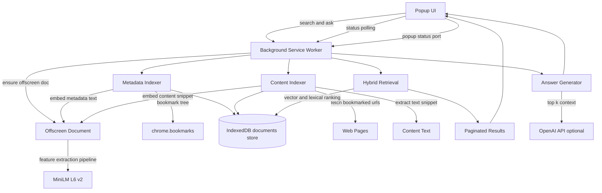

# Bookmark RAG Search (Chrome MV3)

Semantic bookmark search extension for Chrome that combines:
- Metadata embeddings (title, folder, URL)
- Bookmark page-content embeddings (fetched and extracted text)
- Hybrid ranking (vector + lexical)
- Optional RAG answers with citations

## Libraries and APIs Used

- `@xenova/transformers` (`^2.17.2`): in-browser ONNX inference and embedding pipeline
- `Xenova/all-MiniLM-L6-v2`: 384-dim embedding model
- `chrome.bookmarks` API: read bookmark tree and watch changes
- `chrome.storage` API: persist settings
- `chrome.offscreen` API: run embedding worker outside popup/service-worker hot paths
- IndexedDB: local persistence for bookmark docs + vectors
- OpenAI Chat Completions API (optional, for answer generation)

## Build and Run

### 1) Install dependencies and vendor assets

```bash
cd /Users/bernal/git/bookmark-rag-extension
npm run setup
```

Equivalent manual commands:

```bash
npm install
npm run vendor
```

### 2) Load extension in Chrome

1. Open `chrome://extensions`
2. Enable **Developer mode**
3. Click **Load unpacked**
4. Select `/Users/bernal/git/bookmark-rag-extension`

### 3) First-run behavior

- Metadata indexing starts in background
- Content indexing starts after metadata pass finishes
- Model assets are downloaded and cached on first use
- Popup shows a blue progress bar for bookmark metadata indexing
- Popup shows a red progress bar for bookmark content indexing

### 4) Use it

- Open popup and search bookmarks
- Results load in pages of 12 with infinite scroll
- Use **Ask** to generate RAG answers with source bookmarks
- Configure API key/model in Options page if you want LLM answers

## Architecture (Mermaid)



## Indexing Design

- Metadata index fields: `id`, `title`, `url`, `folderPath`, `dateAdded`, `text`, `searchText`, `embedding`
- Content index fields: `contentText`, `contentEmbedding`, `contentUpdatedAt`
- Metadata index is event-driven (`onCreated`, `onChanged`, `onMoved`, `onRemoved`)
- Content index is scheduled after metadata reindex and runs with tighter throttling

## Search and Ranking

- Query embedding (when indexing is idle)
- Lexical matching against `searchText`
- Vector similarity against metadata embedding
- Vector boost from content embedding (when available)
- Combined score used for ranking
- Results returned via offset/limit for infinite scrolling

## Project Structure

- `manifest.json`: extension manifest and permissions
- `background.js`: indexing orchestration, search, status, RAG entrypoints
- `offscreen.html` / `offscreen.js`: embedding pipeline host
- `db.js`: IndexedDB helpers
- `search.js`: ranking logic
- `rag.js`: context construction + optional LLM call
- `popup.*`: search UI + progress bars + infinite scroll
- `options.*`: settings UI + status
- `scripts/sync-vendor.mjs`: copies Transformers.js assets to `vendor/transformers`

## Operational Notes

- This project currently has no test suite or bundler step.
- `npm run vendor` is required whenever `@xenova/transformers` changes.
- Content indexing requires broad URL fetch permissions (`<all_urls>`).
- Some pages block automated fetch/CORS; those bookmarks may have empty `contentText`.
